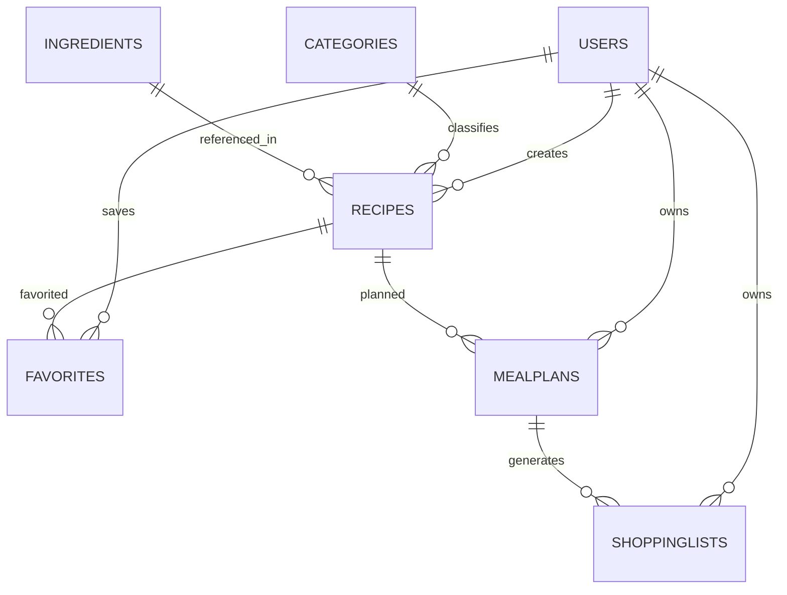

# Rapport - Saveur Recipe Meal Planner

## 1. Presentation du projet

Saveur est une application web de recettes de cuisine. Elle permet aux utilisateurs de creer leurs propres recettes, consulter un catalogue public, ajouter des favoris, planifier les repas de la semaine et generer automatiquement une liste de courses.

## 2. Technologies utilisees

- Frontend: React, TypeScript, Vite, Tailwind CSS
- Backend: Node.js, Express
- Base de donnees: MongoDB, Mongoose
- Authentification: JWT et bcryptjs

## 3. Fonctionnalites principales

- Inscription et connexion des utilisateurs
- Hachage des mots de passe avec bcrypt
- Gestion des recettes personnelles
- Catalogue de recettes avec filtres par categorie, temps et difficulte
- Gestion des favoris
- Planification hebdomadaire des repas
- Liste de courses intelligente generee a partir du planning
- Tableau de bord utilisateur

## 4. Diagramme des collections

## 5. Collections MongoDB

- `users`: comptes utilisateurs, role, email et mot de passe hache
- `categories`: categories des recettes
- `ingredients`: ingredients reutilisables avec unite par defaut
- `recipes`: recettes, ingredients embarques, etapes, categorie et createur
- `mealplans`: planning par utilisateur, date, type de repas et recette
- `favorites`: relation utilisateur-recette pour les favoris
- `shoppinglists`: listes de courses generees par semaine

## 6. Securite

Les mots de passe ne sont pas stockes en clair. Ils sont haches avec bcryptjs. Les routes privees utilisent un token JWT envoye dans l'en-tete `Authorization`. Les recettes personnelles, favoris, plans de repas et listes de courses sont relies a l'utilisateur connecte.

## 7. Difficultes rencontrees

- Adapter un prototype initialement mobile/Firebase vers une application web full-stack.
- Modeliser les ingredients avec quantites et unites pour permettre la generation de listes de courses.
- Garder une interface simple tout en couvrant les fonctionnalites demandees.

## 8. Ameliorations possibles

- Ajouter l'edition complete des recettes existantes.
- Ajouter des roles administrateur visibles dans l'interface.
- Ajouter des statistiques nutritionnelles plus detaillees.
- Exporter la liste de courses en PDF.

## 9. Captures d'ecran a inclure

- Tableau de bord
- Catalogue avec filtres
- Creation de recette
- Detail d'une recette
- Planning hebdomadaire
- Liste de courses
